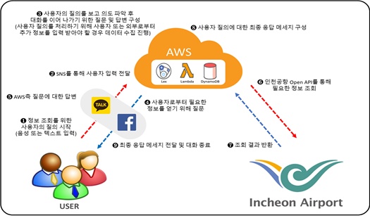
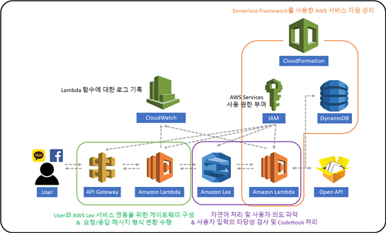

# 한이음 인천공항 AI챗봇(IncheonAirportAiSecretary)

## 소개(Introduction)
"한이음 인천공항 AI챗봇"은 ICT멘토링 프로그램 중 하나인 한이음의 지원을 받아 개발한 서비스로
자연어 처리 서비스인 Amazon Lex를 활용하여 인천공항 관련 정보(출/도착 항공편, 공항 혼잡도 등)를 안내하는 서비스입니다. 

## 주요 기능(Main Function)
 1. 출발 항공편 안내
 2. 도착 항공편 안내
 3. 체크인 및 탑승구 위치 안내
 4. 수화물 수취대 및 출구 위치 안내 
 5. 공향 출국장 혼잡도 안내
 6. 항공사 연락처 안내
 7. 공항 내 편의시설 안내(구현 중)
 8. 공항 주차장 안내(구현 중)
 9. 공항 날씨 안내(구현 중)
 
 
## Product Design

## Collaborators
* [NableKim](https://www.github.com/NableKim) - **SeungSoo Kim** \<nablekim94@gmail.com\> 역할 기입
* [DianaLeee](https://www.github.com/DianaLeee) - **Dayeon Lee** \<이메일\> 역할 기입      
* [rosylee](https://www.github.com/rosylee) - **Ahyun Lee** \<이메일\> 역할 기입
* [Changhyeon Kim](https://www.github.com/Changhyeon Kim) - **Changhyeon Kim** \<이메일\> 역할 기입
